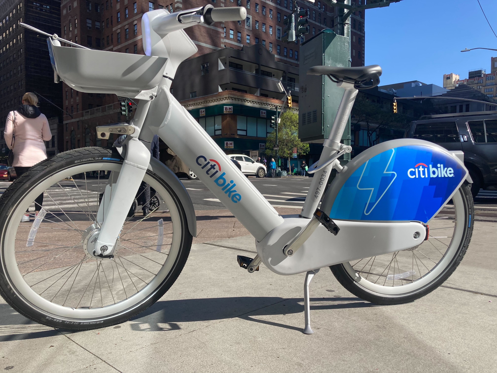

# mlops-zoomcamp-2025-capstone-citibike

## Introduction

The [Citibike system in New York City](https://citibikenyc.com/system-data) provides a convenient and sustainable mode of transportation for both residents and tourists. However, managing the system efficiently involves addressing several challenges, including optimizing bike availability, predicting demand across different areas, and minimizing system downtime.

Key challenges include:

- Bike Availability: Ensuring that bikes are available at stations where demand is highest, especially during peak hours.

- Usage Patterns: Understanding how weather, time of day, and special events affect bike usage.

- Maintenance and Downtime: Minimizing the time bikes are unavailable due to maintenance or malfunction.

Analyzing and predicting these patterns is crucial for improving the user experience and operational efficiency, reducing costs, and supporting the growth of bike-sharing systems as an eco-friendly alternative to traditional transportation.

### Objectives

The objective of this project is to build a predictive model for bike trips using the Citibike NYC dataset. The model will forecast the number of trips per hour, providing valuable insights into bike availability and demand. To achieve this, we seek to answer the following questions:

- How can we predict the number of bike trips per hour with the highest accuracy?
- What is the impact of weather data (e.g., temperature, precipitation) on bike trip predictions?
- How can we set up an MLOps ecosystem to ensure smooth model training, deployment, and monitoring?
- What are the best practices for building efficient training and deployment pipelines?
- How can we deploy the model as a REST API for real-time predictions?
- What methods can be used to monitor the model's performance and detect data drift over time?
- How can we implement best practices like unit testing, code formatting, and pre-commit hooks in the development process?

### Overview

This project aims to build a prediction model for bike trips using the Citibike NYC dataset. The model will forecast the number of trips per hour, providing valuable insights into bike availability and demand. After developing the predictive model, the project will focus on implementing an MLOps pipeline to manage the machine learning lifecycle, from model training and deployment to monitoring and maintenance.

To achieve this, the following tasks will be carried out:

- Predict the number of bike trips per hour: The goal is to develop a regression model to predict the number of trips for each hour of the day. This will provide insights for future bike availability, helping optimize the distribution of bikes across stations.

- Incorporate weather data: Weather conditions are expected to significantly influence bike usage. By integrating meteorological data into the model, we aim to improve the accuracy of predictions based on environmental factors such as temperature, precipitation, and wind speed.

- Set up an MLOps ecosystem: The project will focus on configuring a robust MLOps pipeline for the deployment and management of the regression model. This will ensure seamless training, versioning, and deployment processes.

- Develop training and deployment pipelines: We will design and implement efficient data pipelines for model training and deployment, ensuring scalability and automation throughout the machine learning lifecycle.

- Deploy the model and expose it via a REST API: Once the model is trained, it will be deployed in a production environment, where it will be accessible through a REST API for real-time predictions and integration with other systems.

- Monitor the model and detect data drift: After deployment, continuous monitoring will be implemented to track model performance. Data drift will be detected to ensure the model remains accurate and reliable over time.

- Implement best practices: The project will follow best practices, including unit testing, integrating linting and formatting tools (e.g., black, flake8), setting up pre-commit hooks, and creating a Makefile to streamline development and ensure code quality.

## Technology Stack

This project leverages a diverse set of technologies to support the development and deployment of machine learning models, containerization, and monitoring. For a detailed overview of the tools and libraries used, please refer to the [Technology Stack Documentation](docs/technology-stack.md).

## Datasets

This project uses two primary datasets:

- **CitiBike NYC Dataset**: This dataset contains information about bike trips made by users of the Citi Bike system in New York City. It includes details such as trip duration, start and end stations, ride types, and user membership information. This data helps analyze usage patterns and predict bike availability.

- **NOAA Weather Data**: This dataset provides historical weather information from the National Oceanic and Atmospheric Administration (NOAA). It includes various weather parameters such as temperature, precipitation, wind speed, and snow data, which are used to improve the accuracy of bike trip predictions by factoring in weather conditions.

For detailed descriptions of these datasets, please refer to the [Datasets Documentation](docs/datasets.md).

## Environment Setup

This project requires certain tools and configurations to run correctly. You must ensure that Python 3.12, Docker, and Docker Compose are installed. Additionally, **Poetry** and **Poetry Shell** are used for dependency management and creating isolated environments.

For detailed instructions on how to configure the environment and install the necessary tools, please refer to the [Environment Setup Guide](docs/config-environment.md).

## Running the Workflow with ZenML

This section covers the steps to execute the end-to-end workflow using ZenML. It details how to install necessary dependencies, set up the local ZenML stack, start services, and run the various pipelines for training, deployment, and monitoring. Follow the guide in the [Running the Workflow with ZenML](docs/running-workflow.md) document for a detailed breakdown of each operation.

