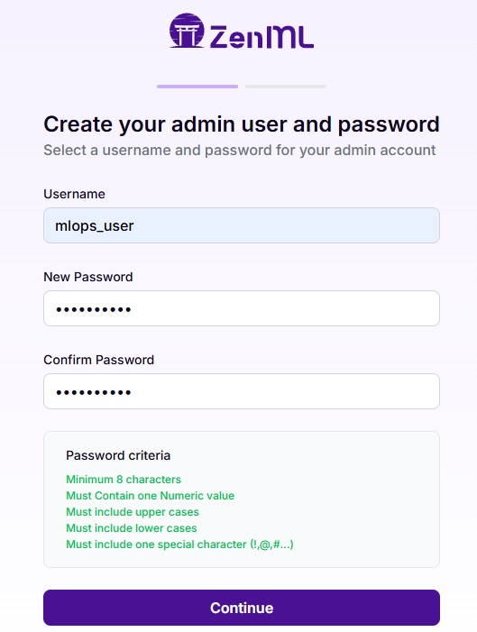
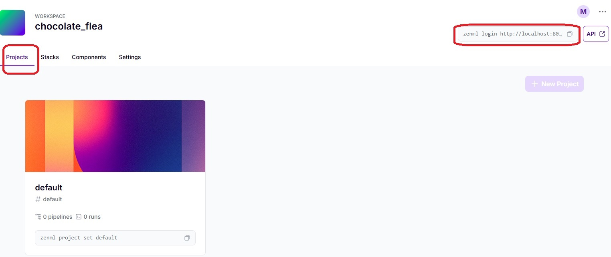
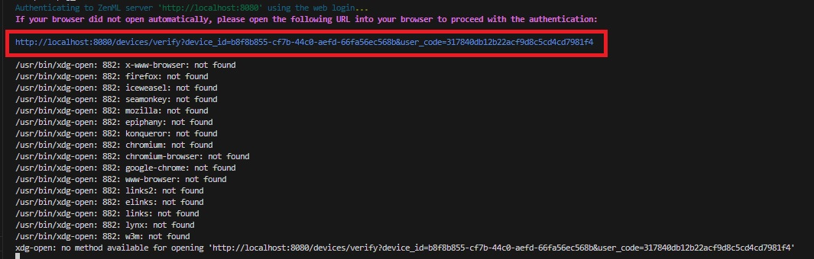
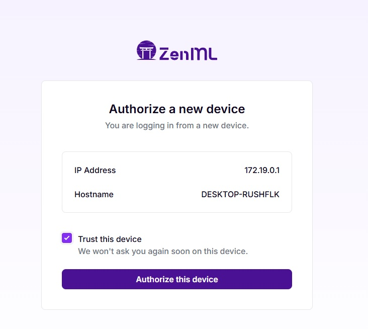
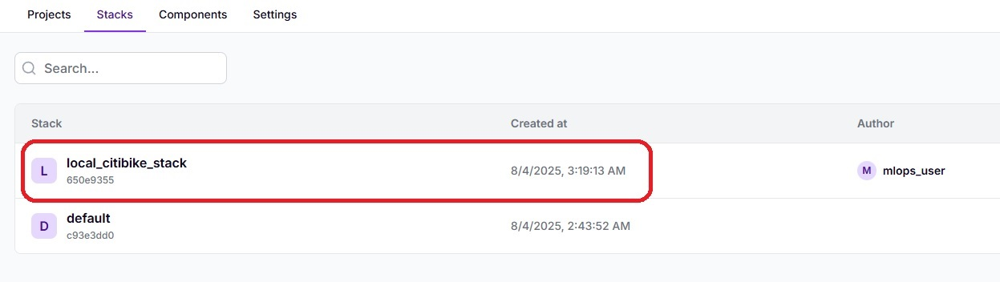
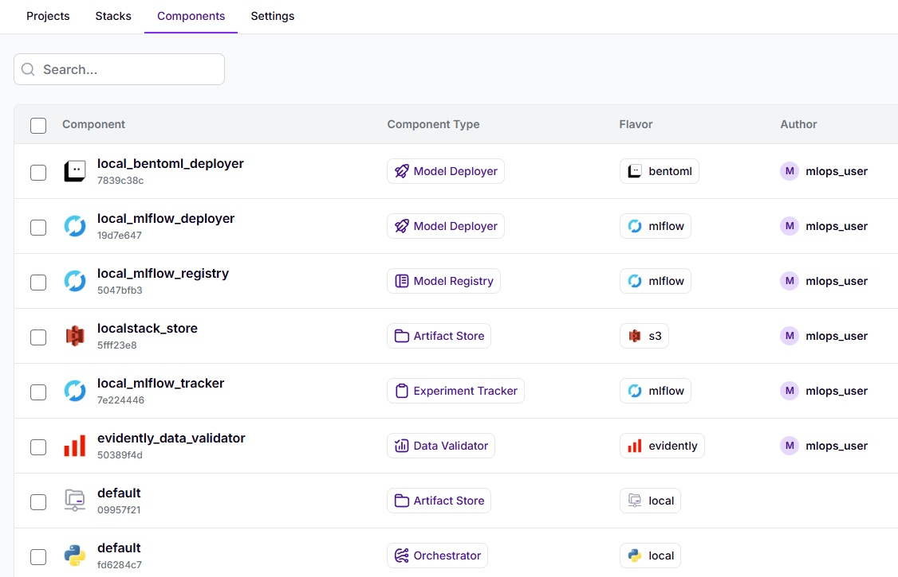
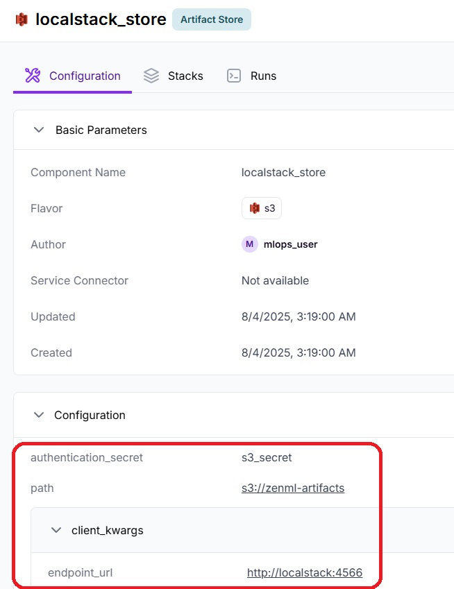
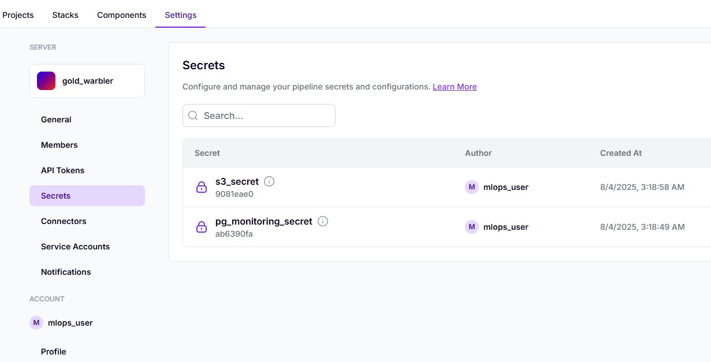
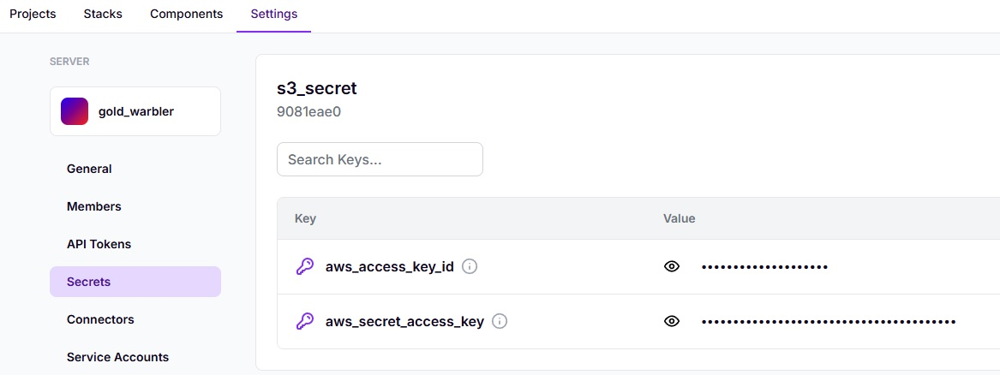
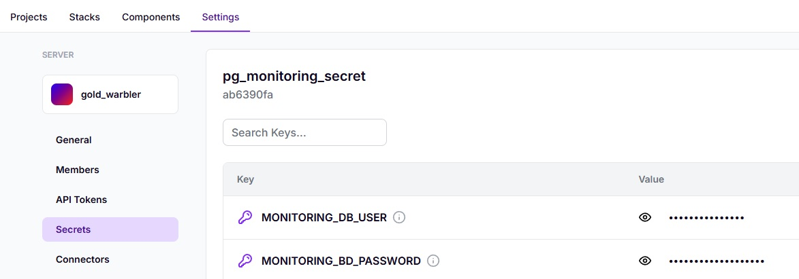

# Environment Setup
Before starting, ensure that your machine has Python 3.12, Docker, and Docker-Compose already installed.

### 1. **Python 3.12** 

This project requires Python 3.12. Ensure that it is installed by running the following command:

```bash
python3 --version
```
The output should confirm that Python 3.12 is installed.

### 2. **Docker**

Docker is required for containerization. Check if Docker is installed and running:

```bash
docker --version
```
You should see the installed Docker version.

### 3. **Docker Compose**

Docker Compose is used for multi-container Docker applications. To verify that Docker Compose is installed:

```bash
docker-compose --version
```

You should see the installed version of Docker Compose.


## Install Poetry

Poetry is a Python dependency management and packaging tool that simplifies dependency management and project configuration. Here’s how to install and verify it:

### 1. **Install Poetry**

To install Poetry, run the following command:

```bash
curl -sSL https://install.python-poetry.org | python3 -
```

### 2. **Add Poetry to PATH**

After installation, you need to ensure that Poetry is in your PATH. Depending on the shell you're using, open the corresponding shell configuration file:

- Bash: Open ~/.bashrc or ~/.bash_profile.

- Zsh: Open ~/.zshrc.

- Fish: Open ~/.config/fish/config.fish.

Add the following line to the appropriate file:

```bash
export PATH="$HOME/.local/bin:$PATH"
```

For example, in Bash, you would open ~/.bashrc and add the above line.

### 3. **Reload the Shell Configuration**

After saving the file, reload the shell configuration by running:

- For Bash:

```bash
source ~/.bashrc
```

- For Zsh:

```bash
source ~/.zshrc
```

- For Fish:

```bash
source ~/.config/fish/config.fish
```

### 4. **Verify Poetry Installation**

After adding Poetry to your **PATH**, you can verify that Poetry is installed and accessible by running:

```bash
poetry --version
```

You should see the version of Poetry installed, e.g., Poetry version 1.7.0.


## Install Poetry Shell

**Poetry Shell** is a plugin that allows you to create and manage isolated virtual environments within your project using Poetry. To install Poetry Shell, follow these steps:

### 1. **Install Poetry Shell Plugin**

To enable Poetry Shell, you need to install the `poetry-plugin-shell` plugin. Run the following command:

```bash
poetry self add poetry-plugin-shell
```

### 2. **Verify Poetry Shell Installation**
Once the plugin is installed, you can initialize a new virtual environment by running:

```bash
poetry shell
```

This command creates and activates a virtual environment for your project. You can verify that the virtual environment is active by running:

```bash
which python
```

This should show the path to the Python interpreter inside the virtual environment.


## Brief Description for the .env Setup

Before installing dependencies and starting the workflow, you need to set up your environment variables. Follow these steps to ensure your environment is properly configured:

Copy the .env.local file to .env:

The .env.local file contains a template for your environment variables. You must copy it to a new .env file.

```bash
cp .env.local .env
```

Customize your .env file:

Open the .env file and customize it with your own credentials (e.g., passwords, API keys, etc.).

Example:

```bash
AWS_ACCESS_KEY_ID=your_aws_access_key
AWS_SECRET_ACCESS_KEY=your_aws_secret_key
DATABASE_PASSWORD=your_database_password
```

## Installing dependencies and configuring zenml

This section describes the steps for installing library dependencies with Poetry. It also describes the steps for installing third-party integrations with ZenML and creating the pipeline execution stack.

### 1. **Install Python Dependencies with Poetry**

First, install all the dependencies defined in the `pyproject.toml` file using Poetry:

```bash
poetry install
```

Verification: Verify Installation with poetry show
To ensure that the dependencies were installed correctly, run the following command to list all installed dependencies:

```bash
poetry show
```

### 2. Verify ZenML Initialization
Before starting the project setup, ensure that ZenML is initialized in your environment. This is necessary to ensure that ZenML can properly manage your pipelines and integrations.

#### Check for the ZenML configuration file:

Navigate to the root directory of your project and check if the .zen/config.yaml file exists. This file indicates that ZenML has already been initialized.

You can check for the file with the following command:

```bash
ls -a .zen/config.yaml
```

- If the file exists, ZenML has already been initialized, and you can proceed with the rest of the setup.
- If the file does not exist, you need to initialize ZenML.

#### Initialize ZenML (if needed):

If the .zen/config.yaml file is missing, run the following command to initialize ZenML in your project:

``` bash
zenml init
```

This will create the necessary configuration file and directory structure for ZenML to manage your ML pipelines and integrations.

#### Verify Initialization:

Once the initialization is complete, you should see the .zen/config.yaml file in your project directory. This confirms that ZenML is set up and ready to use.


### 3. **Install ZenML Dependencies (install-base)**

Next, install the basic dependencies required for ZenML to operate. Use the Make command:

```bash
make install-base
```

After running make install-base, check if the ZenML integrations were successfully installed by running:

```bash
zenml integration list
```

This command will list all the ZenML integrations and show that the required dependencies (e.g., MLflow, BentoML, S3(LocalStack), etc.) are installed.

### 4. **Start ZenML (up)**

Once ZenML and its dependencies are installed, start ZenML and the associated services with Docker Compose:

```bash
make up
```

After starting ZenML with make up, use the following command to list all Docker containers:

```bash
docker ps -a
```

As a result, we will obtain a list of containers that represent the services defined in the docker-compose file and its result should look like the following:

```batch
CONTAINER ID   IMAGE                             COMMAND                  CREATED          STATUS                    PORTS                                                          NAMES
3b198eed3915   ghcr.io/mlflow/mlflow:latest      "/bin/sh -c 'python3…"   38 minutes ago   Up 37 minutes             0.0.0.0:5000->5000/tcp, [::]:5000->5000/tcp                    mlflow
7e355152de07   zenmldocker/zenml-server:0.83.1   "/entrypoint.sh uvic…"   38 minutes ago   Up 38 minutes             0.0.0.0:8080->8080/tcp, [::]:8080->8080/tcp                    zenml
26dff654ba11   localstack/localstack             "docker-entrypoint.sh"   38 minutes ago   Up 38 minutes (healthy)   127.0.0.1:4510-4559->4510-4559/tcp, 127.0.0.1:4566->4566/tcp   localstack
c5993f3cd026   postgres:15                       "docker-entrypoint.s…"   38 minutes ago   Up 38 minutes             0.0.0.0:5432->5432/tcp, [::]:5432->5432/tcp                    mlflow-db
537732dd3ee3   postgres:15                       "docker-entrypoint.s…"   38 minutes ago   Up 38 minutes             0.0.0.0:5433->5432/tcp, [::]:5433->5432/tcp                    grafana-db
2b8fc8b9d60e   grafana/grafana-enterprise        "/run.sh"                38 minutes ago   Up 38 minutes             0.0.0.0:3030->3000/tcp, [::]:3030->3000/tcp                    grafana
e6b5c933cd6f   mysql:8.0                         "docker-entrypoint.s…"   38 minutes ago   Up 38 minutes             0.0.0.0:3306->3306/tcp, [::]:3306->3306/tcp  
```

### 5. **Login in Zenml**

Once the orchestration has started, type the following address into your browser  [http://localhost:8080](http://localhost:8080). 

The first time you start the ZenML server, you'll be presented with a web page to create a user in ZenML. 



Upon subsequent server startups, you must log in with the created user  [http://localhost:8080/login](http://localhost:8080/login).


After following all the user creation steps, go to the projects page, which is located at the following path: [http://localhost:8080/projects](http://localhost:8080/projects).



In order to request the execution of commands or pipelines on the server, we must obtain a token from it. To do this, we need to log in from the command line, to do this we execute the following command:

```batch
zenml login http://localhost:8080
```




The previous command provides us with a URL that we must type into a browser to authorize our machine to run pipeline.



Once the device is authorized, we can make requests to the zenml server.


### 6. **Set Up the MLOps Stack in ZenML (setup-local)**

Now that ZenML is running, set up the MLOps stack using the following Make command:

```bash
make setup-local
```

You can verify the setup by checking the ZenML Console or Web UI. After running make setup-local, check the ZenML interface to ensure the MLOps stack (including MLflow, BentoML, LocalStack) has been successfully configured. You can add relevant screenshots of the ZenML Console for visual confirmation.

To verify the creation of the stack within the web console we navigate to the [stack tab](http://localhost:8080/stacks) 



To verify the creation of the stack components within the web console, navigate to the [components tab](http://localhost:8080/components).



We select the 'localstack store' component to see the configuration and arguments to establish the connection with localstack



Two secrets have been created with the credentials to connect to the localstack (s3) and the monitoring database. To verify the creation of the secrets within the web console, navigate to the [Settings tab](http://localhost:8080/settings/general) and select the [Secrets option](http://localhost:8080/settings/secrets).



The 's3_secret' secret contains the credentials to connect to localstack.



The 'pg_monitoring_secret' secret contains the credentials to connect to the monitoring database.




## Troubleshooting

### Addressing Request Redirection Issues

In some cases, due to the containerized environment, there may be issues with service requests being redirected. To resolve this, you need to add the following entries to your system's hosts file to ensure proper routing to the LocalStack and MLflow services.

#### **For Linux:**

##### 1. Edit your system's hosts file:
- Open the /etc/hosts file using your preferred text editor with root permissions. For example, using nano:

```bash
sudo nano /etc/hosts
```

##### 2. Add the following entries to the hosts file:

```textplain
127.0.0.1 localstack
127.0.0.1 mlflow
```
##### 3. Save the file:

- In nano, press CTRL + X, then Y to confirm, and press Enter to save.

### **For Windows:**

##### 1. Edit the hosts file:
- Open the hosts file located in C:\Windows\System32\drivers\etc\hosts using a text editor with administrative privileges (e.g., Notepad run as Administrator).

##### 2. Add the following entries to the hosts file:

```textplaint
127.0.0.1 localstack
127.0.0.1 mlflow
```
##### 3. Save the file.