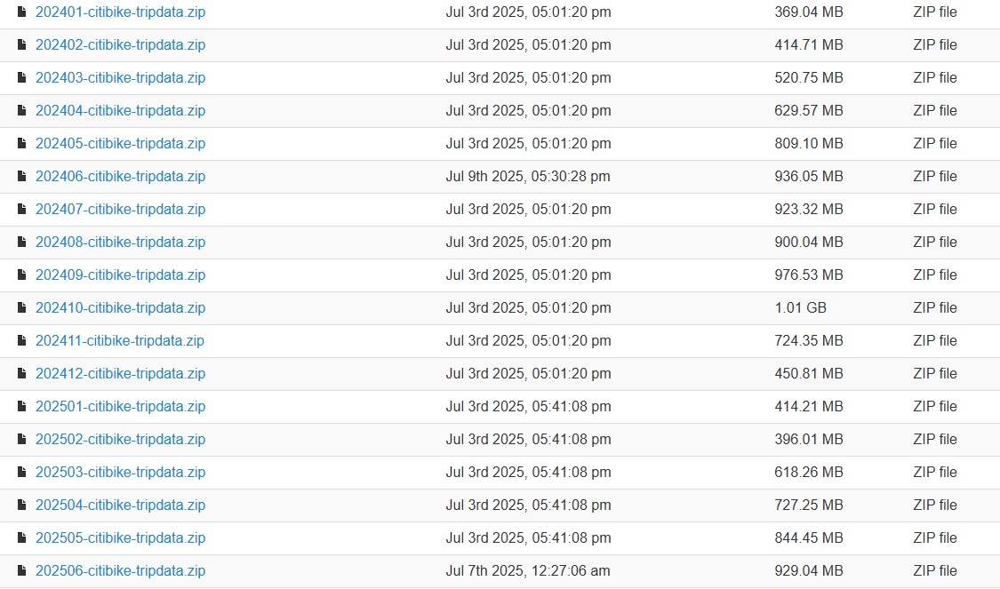

## Datasets

### Dataset: Citi Bike NYC Trip Histories

The [Citi Bike NYC](https://citibikenyc.com/system-data) dataset provides valuable information about the usage of the city's bike-share system. It includes historical trip data that answers key questions such as where riders travel, when they ride, how far they go, and which stations are the most popular. The data is designed to be used by developers, engineers, statisticians, artists, academics, and anyone interested in exploring patterns of bike usage in New York City.

The dataset contains the following key features:

- **Ride ID**: Unique identifier for each bike trip.
- **Rideable Type**: The type of bike used (e.g., classic, electric).
- **Started At**: Timestamp of when the trip started.
- **Ended At**: Timestamp of when the trip ended.
- **Start Station Name**: The name of the station where the trip started.
- **Start Station ID**: Unique identifier for the start station.
- **End Station Name**: The name of the station where the trip ended.
- **End Station ID**: Unique identifier for the end station.
- **Start Latitude**: Latitude of the starting station.
- **Start Longitude**: Longitude of the starting station.
- **End Latitude**: Latitude of the ending station.
- **End Longitude**: Longitude of the ending station.
- **Member or Casual Ride**: Indicates whether the rider is a registered member or a casual user.

This data is made available in accordance with the NYC Bike Share Data Use Policy and can be downloaded for analysis, development, and visualization purposes.

The datasets can be found in the [NYC Citibike Trip History Data Downloads section](https://s3.amazonaws.com/tripdata/index.html). Opening the link above shows a bike trip dataset from 2013 to 2025. However, a format change was made in mid-2020. Because of this, this project will only use bike trip datasets from 2024 and 2025, which are in the new format.

### Dataset: Weather Data from NOAA

This project retrieves weather data from the (**National Oceanic and Atmospheric Administration (NOAA)**)[https://www.ncei.noaa.gov/access] using the API provided by the NOAA Climate Data Online (CDO) Web Service. The dataset includes various weather parameters that can help improve the accuracy of bike trip predictions, especially by considering weather-related factors like temperature, precipitation, and wind conditions.

The data is fetched for a specific **station** (in this case, **LGA station**: GHCND:USW00014732) and for the desired time range. The following weather parameters are collected:

- **TAVG**: Average temperature for the day.
- **TMAX**: Maximum temperature for the day.
- **TMIN**: Minimum temperature for the day.
- **PRCP**: Precipitation (rain) amount.
- **AWND**: Average wind speed.
- **SNOW**: Snowfall for the day.
- **SNWD**: Snow depth at the end of the day.

### Process Overview

1. **Download Range**: Data is downloaded for a specified year and month range (e.g., January to December). The user can define the start and end months for the data collection.
   
2. **API Calls**: The script makes API calls to the NOAA CDO Web Service, retrieving data for each weather parameter in batches of 1,000 records due to API response limits.

3. **Data Formatting**: The retrieved data is processed and stored in a DataFrame with the following columns:
   - **DATE**: The date of the weather observation.
   - **AWND**: Average wind speed.
   - **PRCP**: Precipitation.
   - **SNOW**: Snowfall.
   - **SNWD**: Snow depth.
   - **TAVG**: Average temperature.
   - **TMAX**: Maximum temperature.
   - **TMIN**: Minimum temperature.

4. **Data Cleaning and Transformation**: Duplicate entries are removed, and the data is pivoted to ensure that each weather parameter has its own column. Missing data is dropped to ensure the dataset is clean and ready for analysis.

5. **Data Storage**: The cleaned data is saved in **Parquet** format for efficient storage and future analysis.

### NOAA API Token

To access the NOAA Climate Data Online (CDO) Web Service API, you need to obtain an API token. This token is required to authenticate your requests and retrieve weather data.

To get your token, please follow these steps:

1. Visit the NOAA CDO Web Service token registration page: [NOAA Token Registration](https://www.ncdc.noaa.gov/cdo-web/token).
2. Sign up for an account or log in if you already have one.
3. After logging in, you will be provided with your unique API token.

Once you have your token, you can use it in your API requests by including it in the request headers, as shown in the provided Python code.

### Important Notes:
- The API token is necessary for any request made to the NOAA CDO Web Service.
- Keep your token secure and do not share it publicly.
