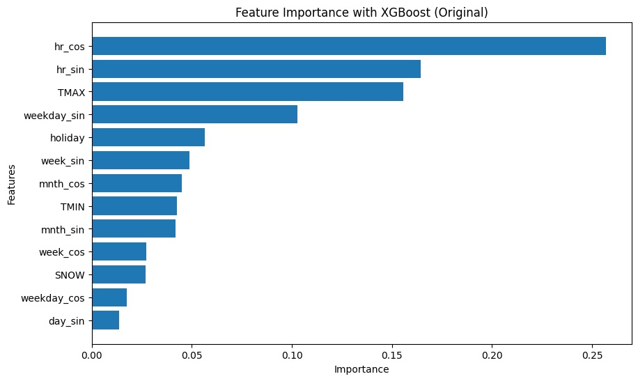

# Exploratory Data Analysis (EDA) - Data Transformation

In the Exploratory Data Analysis (EDA) phase, the raw data from Citibike trips, spanning the period from January 2024 to June 2025, is processed. The data is extracted from ZIP files, which contain multiple CSV files. These files are then processed and transformed as follows:

1. **Data Type Adjustments:**

    - The ride_id column is converted to a string type to ensure consistency in data representation.

2. **Handling Station IDs:**

    - The start_station_id and end_station_id columns are transformed into strings to handle any discrepancies.

    - Any instances where the station IDs are marked as 'nan' (as a string) are replaced with actual NaN values, indicating missing data.

3. **Categorical Data Conversion:**

    - The rideable_type and member_casual columns are converted to categorical types. This transformation optimizes memory usage and improves processing speed during analysis.

4. **Datetime Conversion:**

    - The started_at and ended_at columns, which contain timestamps, are converted to proper datetime types. Any invalid or malformed datetime entries are set to NaT (Not a Time) to handle errors during the conversion.

5. **Data Saving:**

    - Once these transformations are applied, the cleaned data is saved in Parquet format, which is a columnar storage format that allows for efficient reading, writing, and storage of large datasets.

## Missing Values Analysis

During the **Exploratory Data Analysis (EDA)**, a detailed analysis of missing values was performed on the dataset for **January 2024**. The following columns showed varying levels of missing data, with their respective counts and percentages:

| Column Name           | Missing Values | Missing Percentage |
|-----------------------|----------------|--------------------|
| **end_station_id**     | 122,573        | 27.67%             |
| **end_lat**            | 122,304        | 27.61%             |
| **end_lng**            | 122,304        | 27.61%             |
| **end_station_name**   | 114,545        | 25.85%             |
| **start_station_name** | 29,835         | 6.73%              |
| **start_station_id**   | 29,835         | 6.73%              |
| **start_lat**          | 29,835         | 6.73%              |
| **start_lng**          | 29,835         | 6.73%              |

These missing values indicate certain areas where the data may be incomplete, such as the station IDs and names, as well as latitude and longitude for both start and end stations. The significant proportion of missing values in the **end_station_id**, **end_lat**, and **end_lng** columns might be due to incomplete or unrecorded trip data, potentially affecting the accuracy of any geographical or location-based analysis.

## Categorical Variables Analysis
We analyzed the categorical variables in the dataset. The two key categorical variables that were examined are:

### Ride Type Distribution:

The ride_type variable categorizes the type of bike used during the trip. The two types are: 
- Classic Bike 
- Electric Bike

The distribution shows that electric bikes are used more frequently than classic bikes, with the number of electric bike rides significantly surpassing classic bike rides.

### Member Type Distribution:

The member_type variable categorizes riders into two groups:

- Casual: Riders who are not subscribed members of Citibike.

- Member: Riders who have a subscription to Citibike.

The distribution reveals that members account for the vast majority of rides, while casual riders make up a small fraction of the total rides.

## Trip Duration

we analyzed the distribution of trip duration (in minutes). The following observations were made:

- **Distribution Characteristics:**
The distribution of trip duration is highly skewed to the right, as shown in the density plot. The majority of trips have relatively short durations, but there are some outliers with very long trip durations.

- **Short Duration Dominance:**
Most bike trips have durations close to 0-20 minutes, making up the peak of the distribution. Longer trips are less frequent but still present in the dataset.

- **Potential Data Cleaning:**
The presence of long-duration trips could indicate possible outliers or errors in the data (e.g., bikes not returned, system glitches, etc.). These trips may require further investigation or handling to improve the quality of the analysis.

The quartiles and Interquartile Range (IQR) for the trip durations were calculated to better understand the distribution of the data and detect potential outliers.

**Quartiles:**
- 25th Percentile (Q1): 4.66 minutes

- Median (50th Percentile): 7.72 minutes

- 75th Percentile (Q3): 12.93 minutes

**Interquartile Range (IQR):**
- IQR: 8.27 minutes (calculated as the difference between the 75th and 25th percentiles)

**Outlier Detection:**
- Using the IQR, we calculated the upper and lower limits to detect potential outliers:

- Upper Limit: 25.34 minutes

- Lower Limit: -7.75 minutes

However, based on business logic and the assumption that long trips (up to 60 minutes) are valid and should not be excluded, we will maintain all trips up to 60 minutes as part of the analysis.

**Observations:**
- The majority of trips are well within the range defined by the 25th and 75th percentiles.

- The upper limit for detecting outliers suggests that long-duration trips above 25.34 minutes may be considered extreme, but trips up to 60 minutes are maintained for analysis as they are considered part of normal usage.

- The lower limit of -7.75 minutes remains theoretically invalid, indicating potential data quality issues, such as misreported or erroneous trip data.

we analyzed the distribution of trip durations after filtering out negative values and trips exceeding 60 minutes. The distribution is highly skewed to the right, indicating that the majority of trips are relatively short, with only a small number of longer trips.

- **Main Observation**: The peak of the distribution is concentrated around 0-10 minutes, with a significant drop in frequency as the trip duration increases.

- **Skewness**: The tail of the distribution extends towards longer trip durations, but these are much less frequent.

This cleaned distribution is more representative of typical trip durations, excluding any outliers or errors related to abnormally long trips.

## Temporal Analysis

For the temporal analysis, I will only use the first 6 months of 2024 due to computational resource limitations.

### Temporal Analysis of Citibike Trips (January - June 2024)

we observed the distribution of trips across the first six months of 2024. The following points were noted from the monthly trip distribution:

General Trend: The number of trips increases as the year progresses.

January has the fewest trips, likely due to the colder weather conditions.

February sees a slight increase in trips compared to January.

March and April show a gradual rise, possibly indicating better weather and more people using the service.

May and June exhibit the highest number of trips, with June seeing a significant peak, likely due to warmer weather and higher demand for bike rentals.

Observations:
The overall trend indicates that bike usage increases as the weather warms.

The steady rise in trips from January to June suggests a seasonal pattern in Citibike usage.

### Temporal Analysis - Citibike Trips by Day of the Week

In the temporal analysis, we observed the number of Citibike trips made on each day of the week. The distribution of trips across the week is relatively consistent, with only slight variations:

#### **Observation:**

- The number of trips on Monday through Sunday appears to be quite uniform, with a small peak on Thursday and Friday, followed by a minor dip on Sunday.

- Monday to Friday generally show similar usage, indicating that bike usage is fairly consistent during the workweek.

- Saturday and Sunday show slightly lower trip numbers compared to weekdays, likely due to reduced commuting needs over the weekend.

#### **Insights:**
- The data suggests that weekday usage is fairly stable, with no significant spikes or drops.

- The slight increase in trips towards the end of the workweek (Thursday and Friday) might indicate higher demand during commuting hours or recreational use.

### Trip Duration - Citibike Trips by Day of Year (2024)

We examine the distribution of Citibike trips across the days of the year for 2024. The scatter plot illustrates the relationship between the day of the year (from 1 to 365) and the number of Citibike trips on each day.

#### **Observations:**
- **Trend**: There is a clear upward trend in the number of trips as the year progresses. Early in the year (i.e., the first few months), the number of trips is relatively lower.

- **Seasonality**: The graph suggests higher trip counts starting from the spring months (around day 60 onwards), indicating that better weather likely increases bike usage.

Peak Demand: We also observe a significant rise in trips as the year progresses, especially in the late spring and summer months.

#### **Insights:**
- This seasonal trend aligns with the expected patterns of outdoor activity, where warmer months drive more demand for bike-sharing services.

- The early-year months show a slower uptake, likely due to colder weather and fewer people using the service.

### Citibike Trips by Hour of Day (2024)

We observed the number of trips made during each hour of the day in 2024. The histogram illustrates the following trends:

- **Morning Rush (7:00 AM - 9:00 AM)**:
The number of trips starts to increase significantly around 7 AM, peaking at 8 AM. This indicates a high demand for bikes during the morning commute hours.

- **Midday**:
After the morning rush, the number of trips remains relatively high until around 12 PM, indicating consistent use of the service during midday.

- **Evening Rush (4:00 PM - 6:00 PM)**:
A second peak in trip numbers is observed around 5 PM, coinciding with the end of the workday and the evening commute, showing a pattern similar to the morning rush.

- **Nighttime**:
After 7 PM, the number of trips declines gradually, with the lowest number of trips observed around midnight.

#### **Insights:**
- The distribution shows clear peak hours during the morning and evening, likely corresponding to commuting patterns.

- The data suggests lower usage during late-night hours, which may indicate that the system is primarily used for commuting and daytime activities.

## Station Analysis

### Most Popular Citibike Stations (Top 20)

In the Stations and Routes Analysis, we identified the top 20 most popular Citibike stations in New York City based on the number of rides recorded. The following stations consistently showed the highest usage, indicating their role as major hubs for bike-sharing activity:

Top 5 Most Popular Stations:
- W 21 St & 6 Ave

    - Number of Rides: ~30,000

- 8 Ave & W 31 St

    - Number of Rides: ~25,000

- Broadway & W 25 St

    - Number of Rides: ~22,000

- Broadway & W 58 St

    - Number of Rides: ~21,000

- 1 Ave & E 68 St

    - Number of Rides: ~19,000

These stations are located in high-traffic areas, such as central Manhattan and near key transportation hubs, making them accessible to a large number of users.

#### **Insights:**
- High-Traffic Areas: The most popular stations are clustered around central Manhattan and near important transit points (e.g., Broadway and E 14th St). These locations are likely influenced by the density of residential, commercial, and transit hubs.

- Consistent Usage: The consistent number of rides across multiple months shows that these stations are key points of activity for Citibike users, catering to both commuters and tourists.

### Most Popular Citibike Routes (Top 20)

In the Stations and Routes Analysis, we identified the top 20 most popular Citibike routes in New York City, based on the number of rides between specific pairs of stations. The following routes consistently showed the highest usage:

Top 5 Most Popular Routes:
-  Central Park S & 6 Ave to Central Park S & 6 Ave

    - Number of Rides: ~16,000

- 7 Ave & Central Park South to 7 Ave & Central Park South

    - Number of Rides: ~12,000

- Roosevelt Island Tramway to Roosevelt Island Tramway

    - Number of Rides: ~10,500

- River Ter & Warren St to Vesey Pl & River Terrace

    - Number of Rides: ~9,500

- Soissons Landing to Soissons Landing

    - Number of Rides: ~9,000

#### **Insights:**
- High Traffic Routes: The most popular routes, such as between Central Park S & 6 Ave and 7 Ave & Central Park South, reflect key locations in high-traffic areas like Central Park and nearby transportation hubs.

- Utilization of Scenic or High-Demand Routes: Certain routes, such as the Roosevelt Island Tramway or River Ter & Warren St, are popular due to their scenic locations or proximity to significant landmarks and attractions.

## Weather and  Citibike trips dataset

Based on the previous analysis, it is evident that the usage of Citibikes is influenced by various temporal factors, including daily, hourly, and monthly patterns. Additionally, an important factor impacting bike usage is whether the day is a public holiday or not.

Another significant observation is the increase in trips as the summer months approach, highlighting the seasonal nature of bike usage. This trend emphasizes the need to incorporate key weather-related variables, such as maximum and minimum temperatures and the presence of snow, into the analysis.

To address these factors, the dataset I am constructing will include hourly bike trip data, along with a field indicating whether the day was a public holiday in NYC. This will allow for a more comprehensive understanding of how both temporal and climatic variables influence bike usage.

### Dataset Description

The dataset contains hourly Citibike trip data, with each record representing the number of trips made during a specific hour on a given day. The dataset includes the following columns:

1. **date**: The date of the trip, in **YYYY-MM-DD** format.
2. **hour**: The hour of the day (from 0 to 23) when the trip count was recorded.
3. **trips**: The number of Citibike trips that occurred during the specified hour.
4. **holiday**: A binary indicator showing whether the day is a public holiday in New York City.
   - **1**: The day is a public holiday.
   - **0**: The day is not a public holiday.

#### Sample Data:

| date       | hour | trips | holiday |
|------------|------|-------|---------|
| 2024-12-31 | 23   | 162   | 0       |
| 2025-01-01 | 0    | 1583  | 1       |
| 2025-01-01 | 1    | 2676  | 1       |
| 2025-01-01 | 2    | 2260  | 1       |
| 2025-01-01 | 3    | 1324  | 1       |

#### Purpose of the Dataset:
- The dataset is designed to analyze **hourly bike trip usage** over time, taking into account **seasonality**, **public holidays**, and other temporal factors that influence bike demand.
- The **holiday** field is essential for understanding how bike usage differs on holidays compared to regular days.

### Climate Data Description

The climate data is sourced from the **National Oceanic and Atmospheric Administration (NOAA)** and contains daily weather information. The dataset includes the following columns:

1. **DATE**: The date of the weather data, in **YYYY-MM-DD** format.
2. **AWND**: Average wind speed (in miles per hour) for the day.
3. **PRCP**: Precipitation (in inches) for the day, representing the total amount of rain or snowmelt.
4. **SNOW**: Snowfall (in inches) for the day.
5. **SNWD**: Snow depth (in inches) for the day, representing the amount of snow on the ground.
6. **TAVG**: Average temperature (in Fahrenheit) for the day.
7. **TMAX**: Maximum temperature (in Fahrenheit) recorded for the day.
8. **TMIN**: Minimum temperature (in Fahrenheit) recorded for the day.

#### Sample Data:

| DATE       | AWND | PRCP | SNOW | SNWD | TAVG | TMAX | TMIN |
|------------|------|------|------|------|------|------|------|
| 2024-01-01 | 6.7  | 0.01 | 0.0  | 0.0  | 43.0 | 47.0 | 36.0 |
| 2024-01-02 | 9.4  | 0.00 | 0.0  | 0.0  | 37.0 | 43.0 | 30.0 |
| 2024-01-03 | 9.2  | 0.00 | 0.0  | 0.0  | 39.0 | 43.0 | 35.0 |
| 2024-01-04 | 15.0 | 0.00 | 0.0  | 0.0  | 41.0 | 45.0 | 29.0 |
| 2024-01-05 | 11.9 | 0.00 | 0.0  | 0.0  | 32.0 | 38.0 | 27.0 |

#### Purpose of the Dataset:
- The dataset is used to analyze the impact of **weather conditions** on Citibike usage. By including variables like **temperature**, **precipitation**, and **wind speed**, we can better understand how weather patterns correlate with the number of bike trips.
- The **snow** and **snow depth** variables are particularly useful for assessing how extreme weather conditions affect bike usage, especially during winter months.

# **Building and Selecting Key Features for Model Accuracy**

## Feature Engineering Process - Temporal Features
The preprocess_data function performs several transformations and feature engineering steps to prepare the data for model training. These include generating new temporal features and applying transformations like sine and cosine functions to capture cyclical patterns in time-related variables.

### Key Steps in the Feature Engineering Process:
1. Extract Date Components:

    - Day of the Week: A feature is created to represent the day of the week, ranging from 0 (Monday) to 6 (Sunday).

    - Day of the Year: The day of the month is extracted to capture daily patterns.

    - Week Number: The ISO week number is added to understand weekly trends.

    - Month: The month of the year is extracted to capture seasonal effects.

    - Year: The year is extracted for time-based segmentation.

2. Cyclical Features:
    - To capture the cyclical nature of time, sine and cosine transformations are applied to different time-based features. This is crucial because attributes like     hours, days of the week, and months follow periodic patterns. The following new features are created:

        - Hour (hr_sin, hr_cos): Transforming the hour of the day (0-23) using sine and cosine to capture daily cycles.
    
        - Weekday (weekday_sin, weekday_cos): Sine and cosine transformations of the day of the week (0-6).

        - Week (week_sin, week_cos): Sine and cosine transformations of the week number (1-52).

        - Month (mnth_sin, mnth_cos): Sine and cosine transformations of the month (1-12).

        - Day of the Year (day_sin, day_cos): Sine and cosine transformations for the day of the year (1-366) to account for the yearly cycle.

3. Datetime Index:
    - A new index is created by combining the date and hour columns into a datetime object. This index is helpful for time-based analysis and model training.

4. Drop Unnecessary Columns:
    - Columns such as date, hour, weekday, mnth, week_num, and others that are no longer needed for model training are dropped. Only the transformed features are retained.

### Merged Citibike and Climate Data

For the analysis, only the following climate features will be considered from the NYC Climate Dataset to simplify the analysis:

- TMAX: Maximum temperature (in Fahrenheit).

- TMIN: Minimum temperature (in Fahrenheit).

- SNOW: Snowfall (in inches).

These features are essential for understanding the weather's impact on bike usage, particularly in relation to temperature and snow conditions.

#### Merging Process:
The next step involves merging the Citibike dataset with the NYC Climate dataset. The merge will be done using the date field from the Citibike dataset and the DATE field from the climate dataset.

- Merging Key:

    - date (from the Citibike dataset)

    - DATE (from the climate dataset)

This merge will allow us to integrate the relevant weather features with the bike trip data, enabling us to analyze how temperature and snow conditions impact the number of Citibike trips on any given day.

The dataset consists of hourly **Citibike trip data** merged with relevant **climate features**. The data includes both temporal and weather-related variables that help analyze the relationship between weather conditions and bike usage. Below is a description of the columns in the dataset:

#### Columns:

1. **trips**: The number of Citibike trips during the specified hour.
2. **holiday**: A binary indicator showing whether the day is a public holiday in New York City.
   - **1**: Public holiday.
   - **0**: Non-holiday day.
3. **TMAX**: The maximum temperature (in Fahrenheit) for the day.
4. **TMIN**: The minimum temperature (in Fahrenheit) for the day.
5. **SNOW**: The snowfall amount (in inches) for the day.
6. **year**: The year of the data point.
7. **hr_sin**: Sine transformation of the hour of the day (captures the cyclical nature of time).
8. **hr_cos**: Cosine transformation of the hour of the day.
9. **weekday_sin**: Sine transformation of the weekday (captures weekly cyclical patterns).
10. **weekday_cos**: Cosine transformation of the weekday.
11. **week_sin**: Sine transformation of the week number (captures weekly seasonal patterns).
12. **week_cos**: Cosine transformation of the week number.
13. **mnth_sin**: Sine transformation of the month number (captures monthly cyclical patterns).
14. **mnth_cos**: Cosine transformation of the month number.
15. **day_sin**: Sine transformation of the day of the year (captures yearly cyclical patterns).
16. **day_cos**: Cosine transformation of the day of the year.

#### Sample Data:

| Date                | Trips | Holiday | TMAX | TMIN | SNOW | Year | Hr_sin  | Hr_cos  | Weekday_sin | Weekday_cos | Week_sin | Week_cos | Mnth_sin | Mnth_cos | Day_sin | Day_cos |
|---------------------|-------|---------|------|------|------|------|---------|---------|-------------|-------------|----------|----------|----------|----------|---------|---------|
| 2025-01-01 00:00:00 | 1583  | 1       | 52.0 | 40.0 | 0.0  | 2025 | 0.0000  | 1.0000  | 0.9749      | -0.2225     | 0.0      | 1.0      | 0.0      | 1.0      | 0.0     | 1.0     |
| 2025-01-01 01:00:00 | 2676  | 1       | 52.0 | 40.0 | 0.0  | 2025 | 0.2588  | 0.9659  | 0.9749      | -0.2225     | 0.0      | 1.0      | 0.0      | 1.0      | 0.0     | 1.0     |
| 2025-01-01 02:00:00 | 2260  | 1       | 52.0 | 40.0 | 0.0  | 2025 | 0.5000  | 0.8660  | 0.9749      | -0.2225     | 0.0      | 1.0      | 0.0      | 1.0      | 0.0     | 1.0     |
| 2025-01-01 03:00:00 | 1324  | 1       | 52.0 | 40.0 | 0.0  | 2025 | 0.7071  | 0.7071  | 0.9749      | -0.2225     | 0.0      | 1.0      | 0.0      | 1.0      | 0.0     | 1.0     |
| 2025-01-01 04:00:00 | 753   | 1       | 52.0 | 40.0 | 0.0  | 2025 | 0.8660  | 0.5000  | 0.9749      | -0.2225     | 0.0      | 1.0      | 0.0      | 1.0      | 0.0     | 1.0     |

#### Purpose of the Dataset:
This merged dataset allows for a comprehensive analysis of the relationship between **weather conditions** and **Citibike trip usage**. The **TMAX**, **TMIN**, and **SNOW** variables from the climate data provide insight into how temperature and snowfall impact bike trips. The **cyclical features** (such as **hourly**, **weekday**, and **monthly** transformations) capture temporal patterns in bike usage, which are essential for predictive modeling.

## Feature Importance Calculation with XGBoost Regressor

In the process of determining the most important features for predicting Citibike trip usage, we utilized the XGBoost Regressor to calculate the feature importance. XGBoost provides a feature importance score that indicates the contribution of each feature to the model’s predictive performance. The following table summarizes the importance of each feature, ranked by their contribution to the model:

Scenario 1: All variables

Scenario 2: Deleting the variables: "year", "day_cos"

Scenario 3: Deleting the variables: "year", "day_cos", "day_sin"

Below is a table showing the mse metrics for the three scenarios described above.

| Scenario                           | MSE                |
|------------------------------------|--------------------|
| All Features                       | 414,481.61         |
| Remove "year", "day_cos"           | 414,481.61         |
| Remove "year", "day_cos", "day_sin"| 434,152.67         |

Scenario 3 may be a valid option. Despite having a higher MSE, it allows us to reduce model complexity and work with fewer features.

## Final Dataset After Feature Selection

After applying **feature selection** (removing **"year"**, **"day_cos"**, and **"day_sin"**), the dataset is now optimized for model training. The resulting dataset contains the following columns:

#### Columns:

1. **trips**: The number of Citibike trips made during the specified hour.
2. **holiday**: A binary indicator showing whether the day is a public holiday in New York City.
   - **1**: Public holiday.
   - **0**: Non-holiday day.
3. **TMAX**: Maximum temperature (in Fahrenheit) for the day.
4. **TMIN**: Minimum temperature (in Fahrenheit) for the day.
5. **SNOW**: Snowfall (in inches) for the day.
6. **hr_sin**: Sine transformation of the hour of the day (captures the cyclical nature of time).
7. **hr_cos**: Cosine transformation of the hour of the day.
8. **weekday_sin**: Sine transformation of the weekday (captures weekly cyclical patterns).
9. **weekday_cos**: Cosine transformation of the weekday.
10. **week_sin**: Sine transformation of the week number (captures weekly seasonal patterns).
11. **week_cos**: Cosine transformation of the week number.
12. **mnth_sin**: Sine transformation of the month number (captures monthly cyclical patterns).
13. **mnth_cos**: Cosine transformation of the month number.

### Sample Data:

| Date                | Trips | Holiday | TMAX | TMIN | SNOW | Hr_sin  | Hr_cos  | Weekday_sin | Weekday_cos | Week_sin | Week_cos | Mnth_sin | Mnth_cos |
|---------------------|-------|---------|------|------|------|---------|---------|-------------|-------------|----------|----------|----------|----------|
| 2024-01-01 00:00:00 | 1862  | 1       | 47.0 | 36.0 | 0.0  | 0.0000  | 1.0000  | 0.0         | 1.0         | 0.0      | 1.0      | 0.0      | 1.0      |
| 2024-01-01 01:00:00 | 2289  | 1       | 47.0 | 36.0 | 0.0  | 0.2588  | 0.9659  | 0.0         | 1.0         | 0.0      | 1.0      | 0.0      | 1.0      |
| 2024-01-01 02:00:00 | 1902  | 1       | 47.0 | 36.0 | 0.0  | 0.5000  | 0.8660  | 0.0         | 1.0         | 0.0      | 1.0      | 0.0      | 1.0      |
| 2024-01-01 03:00:00 | 1081  | 1       | 47.0 | 36.0 | 0.0  | 0.7071  | 0.7071  | 0.0         | 1.0         | 0.0      | 1.0      | 0.0      | 1.0      |
| 2024-01-01 04:00:00 | 634   | 1       | 47.0 | 36.0 | 0.0  | 0.8660  | 0.5000  | 0.0         | 1.0         | 0.0      | 1.0      | 0.0      | 1.0      |

### Purpose of the Dataset:
This final dataset combines the **Citibike trip data** with **weather-related features** and temporal components. The selected features, including the sine and cosine transformations of time-based variables (e.g., **hour**, **weekday**, **week number**, and **month**), help capture the cyclical nature of bike usage. By merging **weather data** (e.g., **TMAX**, **TMIN**, **SNOW**) with trip data, we can analyze how **temperature** and **snow conditions** impact bike usage across different times of day and different seasons.
