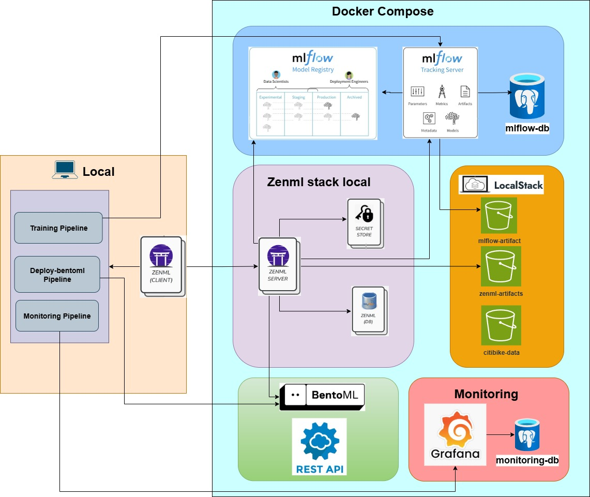

# ML Workflow

To carry out a machine learning project from start to finish in the context of MLOPs, we need a framework that allows us to create machine learning pipelines. This project uses the Zenml tool, which has an agnostic approach and allows us to run the pipelines locally or in the cloud. Additionally, Zenml integrates easily with the most commonly used tools in MLOPs projects, such as MLflow, Airflow, Bentoml, Evidently, and others. The following components will be used for this Zenml project:

- **ZenML**
ZenML provides a web interface for managing and monitoring workflows, experiments, and artifacts. ZenML console allows you to visualize pipeline runs, track model metrics, and access experiment details. It is an essential tool for interacting with the ZenML framework in a more user-friendly manner.

    - ZenML Console URL: http://localhost:8080

        - You can access the ZenML web console locally at this address, where you can monitor your pipelines, view artifacts, and explore experiment metadata.

- **LocalStack**
In this project, LocalStack is used to simulate AWS S3 buckets locally for testing and development purposes. Three S3 buckets are set up to store different types of data:

    - `zenml-artifacts`

        - URL: http://localhost:4566/zenml-artifacts

        - Stores ZenML artifacts like model files, pipelines, and other metadata.

    - `mlflow-artifacts`

        - URL: http://localhost:4566/mlflow-artifacts

        - Stores the model artifacts registered and tracked by MLflow.

    - `citibike-data`

        - URL: http://localhost:4566/citibike-data

        - Contains the raw and processed datasets used for training and evaluation.

- **Artifact Store**
In this project, we use LocalStack to simulate AWS services locally, specifically to simulate S3 buckets as an Artifact Store. The Artifact Store is essential for storing and managing various artifacts produced during the machine learning workflow, such as datasets, model weights, logs, and intermediate results. By using LocalStack, we can interact with an S3-like service without needing to connect to an actual AWS environment, providing an efficient and cost-effective way to handle artifacts during development. LocalStack simulates an S3 bucket locally, allowing the ZenML pipeline to push and pull data from this artifact store seamlessly.

    - LocalStack Artifact Store URL: http://localhost:4566/zenml-artifacts/

- **Tracking Server**
The MLflow tracking server is used to record and serve all the experiment data. It listens on port 5000 by default, and it allows you to interact with the logs, visualizations, and metrics from your machine learning experiments.

    - Tracking server URL: http://localhost:5000

- **Model Registry Server**
The MLflow model registry provides a central repository for storing and managing models. This allows us to store different versions of models and promote them from one stage to another (e.g., from "staging" to "production").

    - Model registry URL: http://localhost:5000

- **Model Deployer**. To deploy trained models, we use BentoML, a tool designed to simplify the production and deployment of machine learning models. BentoML streamlines the process of creating machine learning applications by allowing models to be easily converted into API services for production environments. With BentoML, we can efficiently package, serve, and manage machine learning models. 
    - Once deployed, the model will be accessible at the address [http://localhost:3000/](http://localhost:3000/).

- **Monitoring**.
In this project, we use Evidently to monitor the performance of machine learning models and detect data drift over time. The model drift monitoring is done by comparing historical data (from 2024) and current data (from the first three months of 2025). Once Evidently calculates the drift metrics, these are stored in a PostgreSQL database, which acts as the data store for the drift metrics. The stored data is then visualized using Grafana, which provides an interactive dashboard to monitor model performance and detect data drift. Grafana queries the PostgreSQL database to pull the latest drift metrics and displays them in easy-to-read visualizations.

    - Grafana Dashboard URL: http://localhost:3030/

    - Grafana Port: 3030 (this is where the Grafana dashboard can be accessed locally)

The general ML workflow diagram for this project is shown below.

