# Running Workflow


# Running with Docker-Compose
The easiest way to run the application is with docker-compose.


### **up**
This command starts the Docker Compose services in the background using the docker-compose.yaml file and the .env file. It then runs the localstack-setup.sh script to configure LocalStack (which simulates AWS services locally).

```bash
make up
```

After starting ZenML with make up, use the following command to list all Docker containers:

```bash
docker ps -a
```

As a result, we will obtain a list of containers that represent the services defined in the docker-compose file and its result should look like the following:

```batch
CONTAINER ID   IMAGE                             COMMAND                  CREATED          STATUS                    PORTS                                                          NAMES
3b198eed3915   ghcr.io/mlflow/mlflow:latest      "/bin/sh -c 'python3…"   38 minutes ago   Up 37 minutes             0.0.0.0:5000->5000/tcp, [::]:5000->5000/tcp                    mlflow
7e355152de07   zenmldocker/zenml-server:0.83.1   "/entrypoint.sh uvic…"   38 minutes ago   Up 38 minutes             0.0.0.0:8080->8080/tcp, [::]:8080->8080/tcp                    zenml
26dff654ba11   localstack/localstack             "docker-entrypoint.sh"   38 minutes ago   Up 38 minutes (healthy)   127.0.0.1:4510-4559->4510-4559/tcp, 127.0.0.1:4566->4566/tcp   localstack
c5993f3cd026   postgres:15                       "docker-entrypoint.s…"   38 minutes ago   Up 38 minutes             0.0.0.0:5432->5432/tcp, [::]:5432->5432/tcp                    mlflow-db
537732dd3ee3   postgres:15                       "docker-entrypoint.s…"   38 minutes ago   Up 38 minutes             0.0.0.0:5433->5432/tcp, [::]:5433->5432/tcp                    grafana-db
2b8fc8b9d60e   grafana/grafana-enterprise        "/run.sh"                38 minutes ago   Up 38 minutes             0.0.0.0:3030->3000/tcp, [::]:3030->3000/tcp                    grafana
e6b5c933cd6f   mysql:8.0                         "docker-entrypoint.s…"   38 minutes ago   Up 38 minutes             0.0.0.0:3306->3306/tcp, [::]:3306->3306/tcp  
```

Once the orchestration has started, We log in to the web console which is at the following address [shttp://localhost:8080/login](http://localhost:8080/login). 

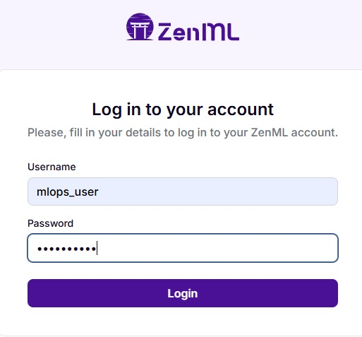


###  **down**
This command stops all Docker Compose containers and saves the current LocalStack state (e.g., buckets and configurations) by running localstack-backup.sh. This ensures that the state is preserved when the containers are stopped.

```bash
make down
```


### **training**
This command executes the training pipeline defined in your [`run.py`](../run.py) file. It loads the training configuration from [`pipelines.local.yaml`](../configs/zenml/pipelines.local.yaml).

```bash
make training
```

In the zenml web console, go to the pipelines tab and select the one that starts with the name "citibike_training_pipeline". 

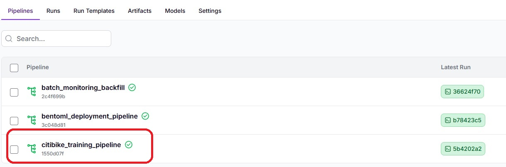

We will be shown a list of all the executions of the training pipeline.

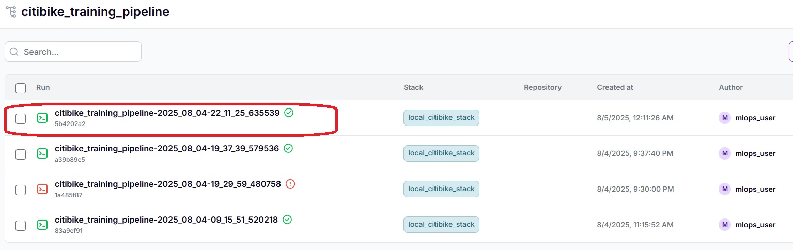

We select the most recent execution

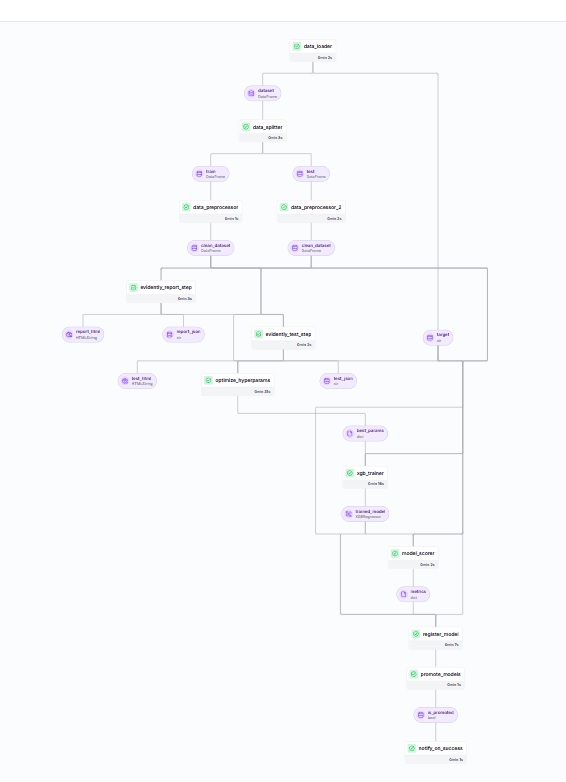

The window on the right offers multiple options for viewing logs, metadata, configuration, and pipeline execution logs. Selecting a specific step will show the specific executions for that step.

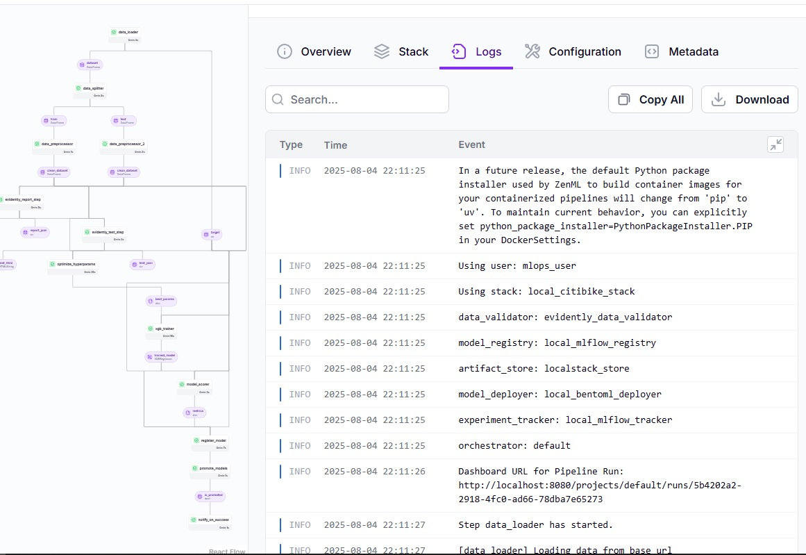


This project uses mlflow to record experiments. The mlflow service runs at the following address [http://localhost:5000/](http://localhost:5000/).
It also uses mlflow to manage candidate models and promote them to production whenever the candidate's rmse exceeds the **threshold** defined in the [pipelines.local.yaml](configs/zenml/pipelines.local.yaml). The registered model 'xgb-citibike-reg-model' is shown below.

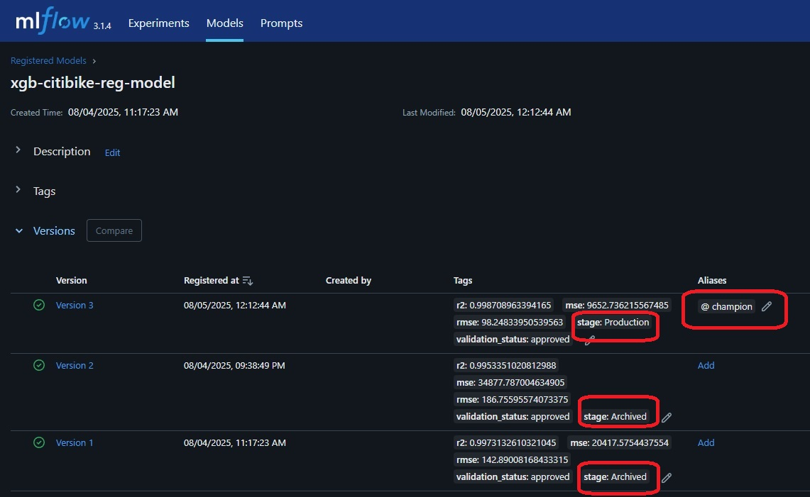

Note that there are several versions of the resisted model 'xgb-citibike-reg-model'. The best model is tagged with the alias champion, and the 'stage' tag is used to track its status. In this case, the model with the alias champion and the 'production' tag is the best model according to the RMSE metric and has been promoted to production. You can also see that the other models have been tagged with the 'stage' tag and the value 'archived' to mark them as archived.

If we select the production model we can see that on its main page there is a link to its execution.

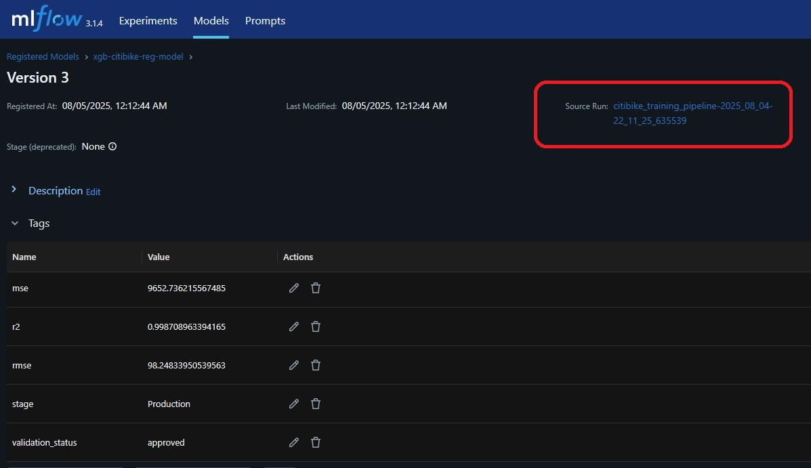

On the registered model execution page, you can see the execution artifacts. You can also see that these artifacts are saved in a localstack bucket.

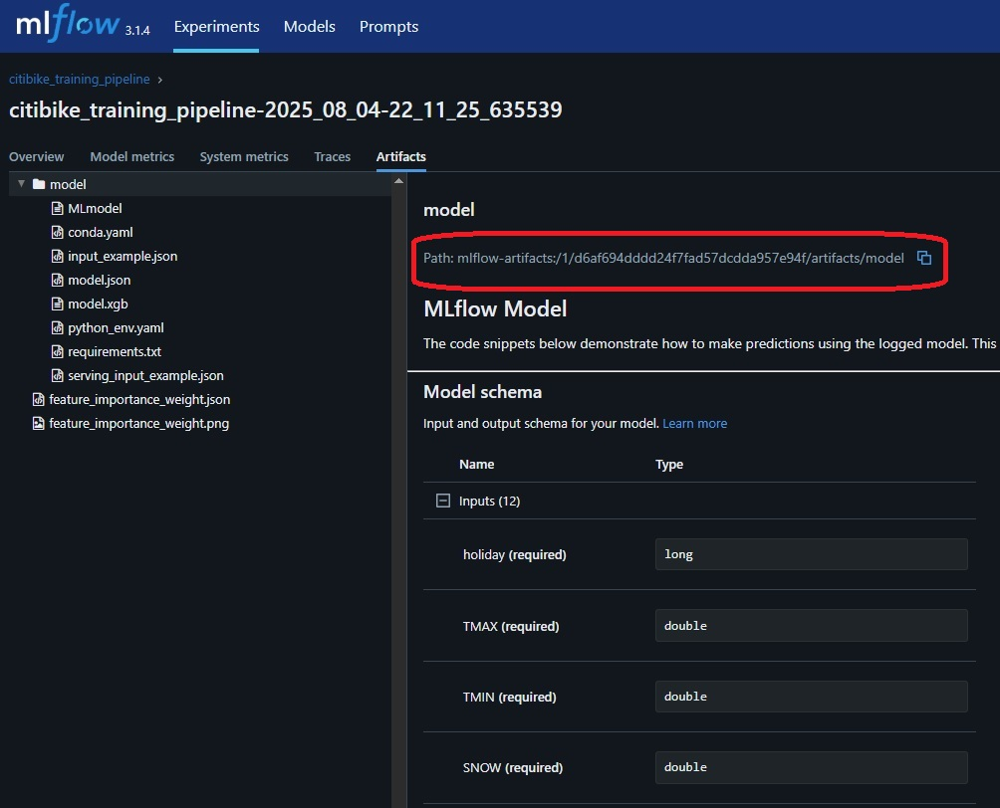


### **deploy-bentoml**
This command runs the deployment pipeline for BentoML, using the configuration from [`pipelines.local.yaml`](../configs/zenml/pipelines.local.yaml). This is where the trained models are packaged and deployed.

```bash
make deploy-bentoml
```

In the zenml web console, go to the pipelines tab and select the one that starts with the name "bentoml_deployment_pipeline".

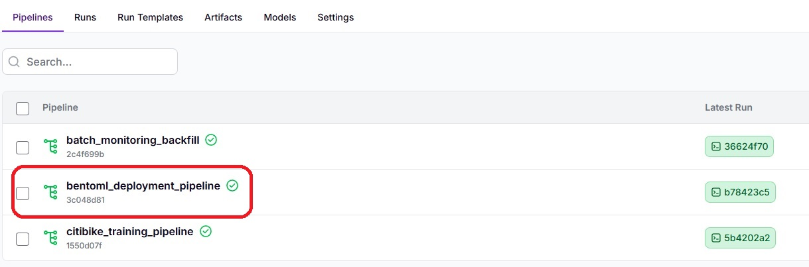

We will be shown a list of all the executions of the monitoring pipeline.

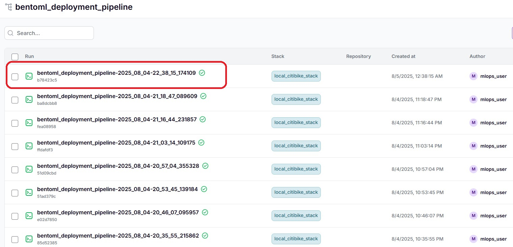

We select the most recent execution

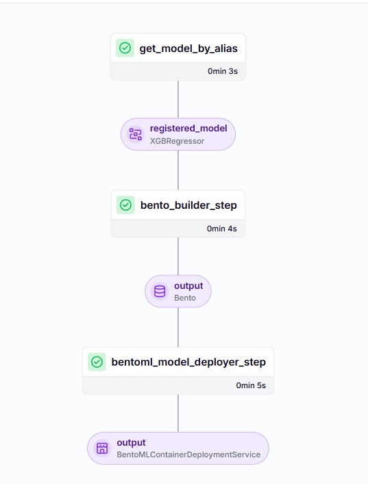

By selecting the bentoml_model_deployer_step output, we can access the metadata tab where the address where the bentlo REST API service has been deployed will be shown.

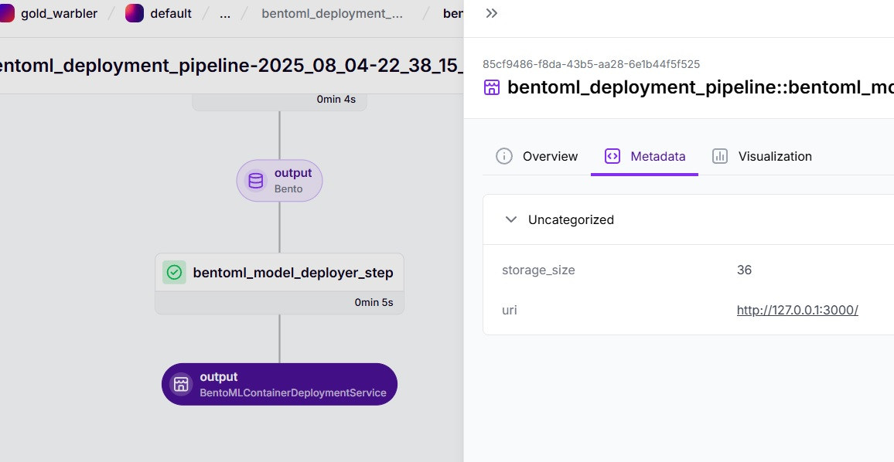


To view whether the bentoml REST API service has started correctly, type the following command:

```bash
zenml model-deployer models list
```

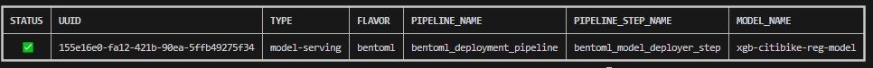


The bentoml REST API service endpoint is located at the following address [http://127.0.0.1:3000/](http://127.0.0.1:3000/):

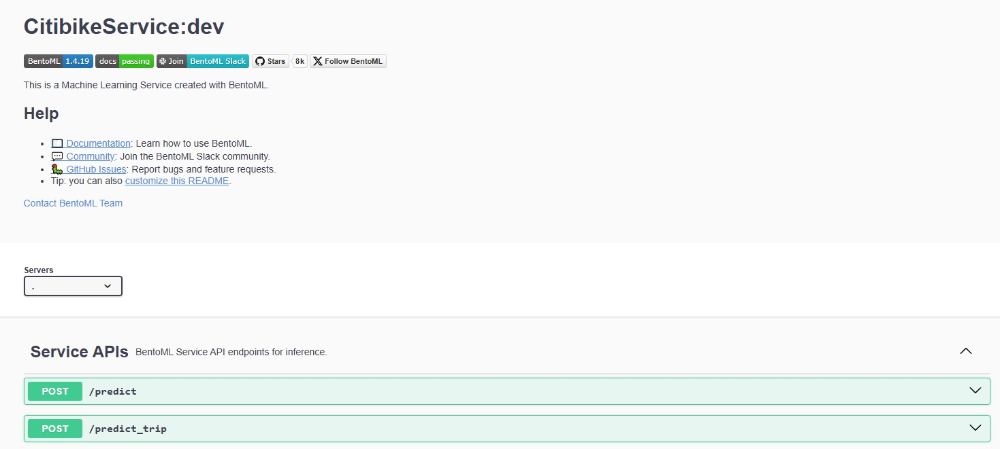


### API Endpoints
1. **POST /predict**
    - Purpose: Make batch predictions using a list of processed input features.

    - Request Body: A JSON array of CitibikeInput objects.

    - Response: A JSON object containing predictions for each input.

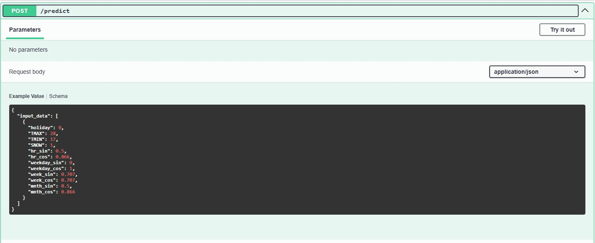

Example Request:

```bash
{
 "input_data": [ 
  {
    "holiday": 0,
    "TMAX": 28.0,
    "TMIN": 17.0,
    "SNOW": 1.0,
    "hr_sin": 0.5,
    "hr_cos": 0.866,
    "weekday_sin": 0.0,
    "weekday_cos": 1.0,
    "week_sin": 0.707,
    "week_cos": 0.707,
    "mnth_sin": 0.5,
    "mnth_cos": 0.866
  }
 ]
}
```

Example Response:

```bash
{
  "predictions": [
    {
      "model": "xgb-citibike-reg-model",
      "prediction": 1234
    }
  ]
}
```

2. **POST /predict_trip**
    - Purpose: Make a prediction for a single Citibike trip based on date and weather features.

    - Request Body: A JSON array of CitibikeRawInput objects.

    - Response: A JSON object with the predicted trip count.

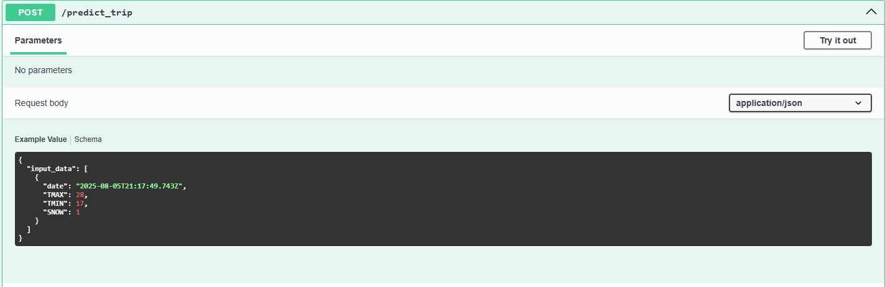

Example Request:

```bash
{
 "input_data": [ 
  {
    "date": "2025-01-01T00:00:00",
    "TMAX": 52.0,
    "TMIN": 40.0,
    "SNOW": 0.0
  }
 ]
}
```

Example Response:

```bash
{
  "predictions": [
    {
      "model": "xgb-citibike-reg-model",
      "prediction": 1583
    }
  ]
}
```

### Testing the API
To test the API, follow these steps:

1. Start the BentoML service:

    - Ensure that the service is running. You can do this by using BentoML's CLI or directly through Docker if the service is containerized.

2. Make a Request:

    - You can use a tool like Postman, curl, or any HTTP client to make a POST request to the relevant endpoint (/predict or /predict_trip).

3. Inspect the Response:

    - The response will contain the predicted trip count for the given input data. Compare the results with the actual data to assess the model's accuracy.

Example curl command to test the /predict_trip endpoint:

```bash
curl -X POST http://localhost:3000/predict_trip \
-H "Content-Type: application/json" \
-d '{
 "input_data": [ 
    {
        "date": "2025-01-01T00:00:00",
        "TMAX": 52.0,
        "TMIN": 40.0,
        "SNOW": 0.0
    }
  ]
}'
```


#### Troubleshooting


To view the REST API service logs with bentoml we must execute the following command.

```bash
zenml model-deployer models logs 155e16e0-fa12-421b-90ea-5ffb49275f34
```


There are times when the deployment may fail and ZenML may not be able to replace the REST API service correctly. To do this, we must delete the deployed model with the following commands.

We search for the identifier of the deployed model with the following command.

```bash
zenml model-deployer models list
```

We copy the identifier of the deployed model "UUID" and execute the following command to delete the deployed model.

```bash
zenml model-deployer models remove 155e16e0-fa12-421b-90ea-5ffb49275f34
```


### **monitoring**
This operation runs the monitoring pipeline, using the configuration from [`pipelines.local.yaml`](../configs/zenml/pipelines.local.yaml), which typically involves checking the model's performance in production, tracking metrics, and possibly detecting data drift.

```bash
make monitoring
```

In the zenml web console, go to the pipelines tab and select the one that starts with the name "batch_monitoring_backfill".

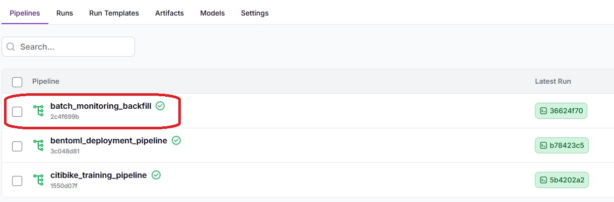


We will be shown a list of all the executions of the monitoring pipeline.

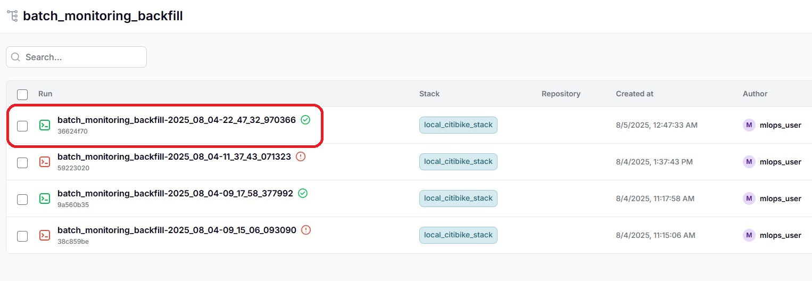

We select the most recent execution

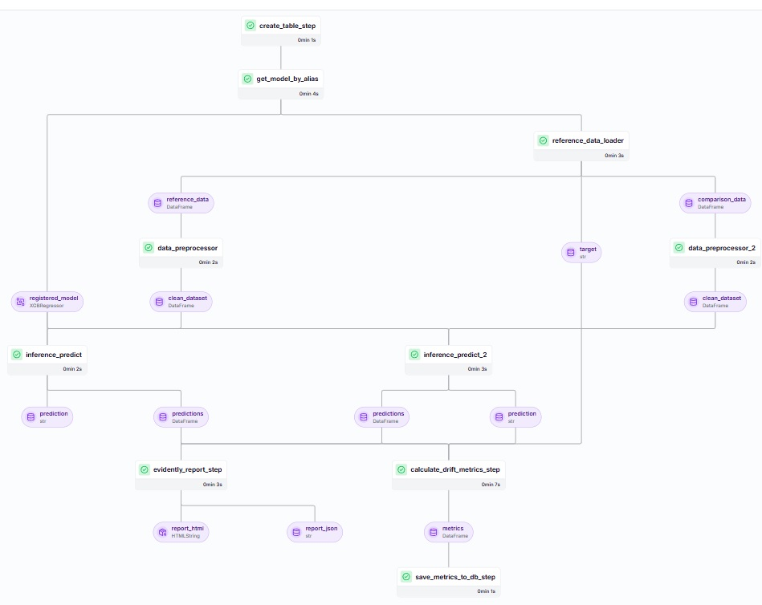

A way of seeing data drifting is through the workflow and selecting the 'report_html' result from the 'evidently_report_step' step.

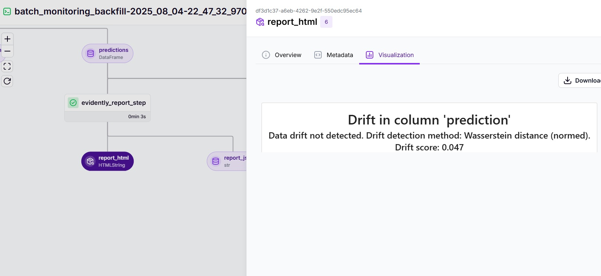


Another way to view monitoring is through a dashboard in Grafana. To do this, go to the following address [http://localhost:3030/dashboards](http://localhost:3030/dashboards).


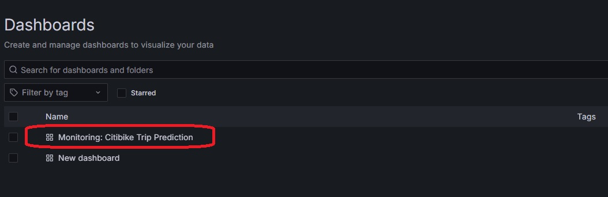

From the list of previous dashboards, we selected the "Monitoring: City Bike Trip Prediction" dashboard.

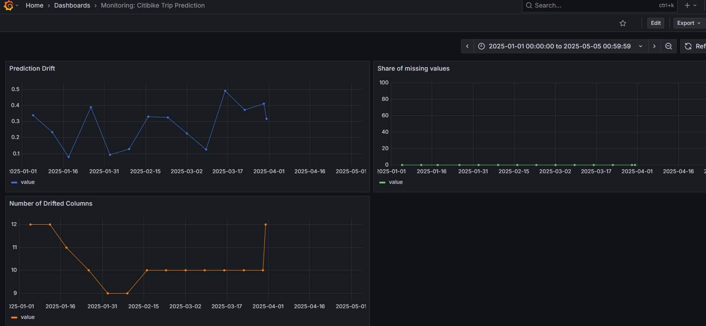

### **test-integration**
This target runs the integration tests defined in the tests/integration directory using pytest.

```bash
make test-integration
```

## Using Pre-commit with Flake8 and Black

In this project, we have integrated pre-commit hooks to automate the process of ensuring code quality and consistent formatting for Python files. Specifically, we are using flake8 for code style checks and black for automatic code formatting.

### **How it works:**
- Pre-commit hooks are automatically triggered before every commit.

- When you run git commit, pre-commit will execute both flake8 and black on Python files:

    - flake8 checks your Python code for any potential style violations or errors, such as indentation issues, unused imports, or logical problems.

    - black automatically formats your Python code to adhere to a consistent style.

### Example Workflow:

1. After making changes to your Python files, you run:

```basht
git add .
git commit -m "Your commit message"
```

2. **pre-commit** will automatically run the configured hooks. It will first check the Python files with flake8 and then format them with black.

3. If any issues are found by flake8, the commit will be rejected, and you will need to fix the identified problems. If black detects formatting issues, it will reformat the code automatically.

4. Once all checks pass, the commit is completed successfully.

This ensures that all Python code follows the specified style and is free from common errors, making it easier to maintain and review.

## Running Jupyter Notebooks

### Run Jupyter

To execute your notebooks, follow these steps:

### 1. Navigate to the Notebooks Directory:
Open your terminal and go to the directory where your notebooks are stored. For example:

```bash
cd notebooks
```

### 2. Start Jupyter Lab:

Once you're in the notebooks directory, start Jupyter Lab by running the following command:

```bash
jupyter lab
```


### Notebooks Overview

#### 1. EDA.ipynb:
This notebook focuses on Exploratory Data Analysis (EDA). It processes the CitiBike NYC dataset and the 2024 and 2025 weather datasets to create the training and test datasets. The notebook explores and visualizes the data to identify key patterns, distributions, and relationships. Key tasks include:

- **Data Cleaning**: Handling missing values, outliers, and duplicates.

- **Feature Engineering**: Preparing the data for machine learning, such as creating time-related features or encoding categorical variables.

- **Data Preprocessing**: Merging the CitiBike and weather datasets to align bike trip data with corresponding weather information for each time period.

- **Splitting Data**: Creating the training and test datasets that will be used in later stages of the machine learning pipeline.

**Note**: This notebook can be memory-intensive due to the large datasets and the complex visualizations. If the kernel runs out of memory, it may need to be restarted.

#### 2. Training.ipynb:
This notebook is focused on training the machine learning model. It includes several steps, such as:

- **Feature Selection**: Experimenting with different sets of features to find the most relevant ones for model training.

- **Feature Engineering**: Creating new features or transforming existing ones to improve model performance.

- **Hyperparameter Optimization (HPA)**: Using Optuna for hyperparameter tuning to find the best configuration for the model.

- **Experiment Tracking**: Registering all experiments and results using MLflow for versioning and tracking model performance over time.
The primary goal is to build a regression model to predict bike trips, considering features like weather conditions and bike usage patterns.

#### 3. Monitoring.ipynb:
This notebook is dedicated to monitoring the model's performance over time. It leverages Evidently to detect data drift and monitor changes in data distribution, which can impact the model's performance. The goal is to continuously track the model's predictions and identify any shifts in the underlying data that may require model retraining.